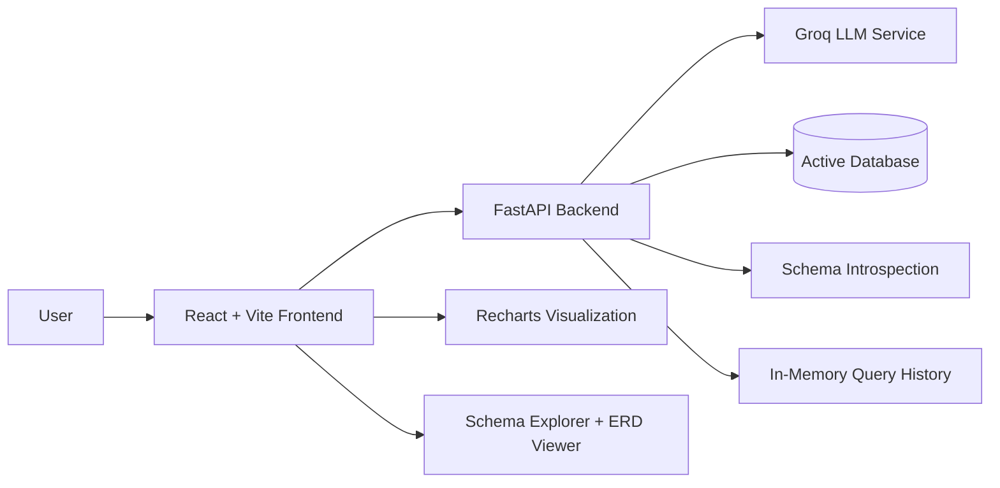
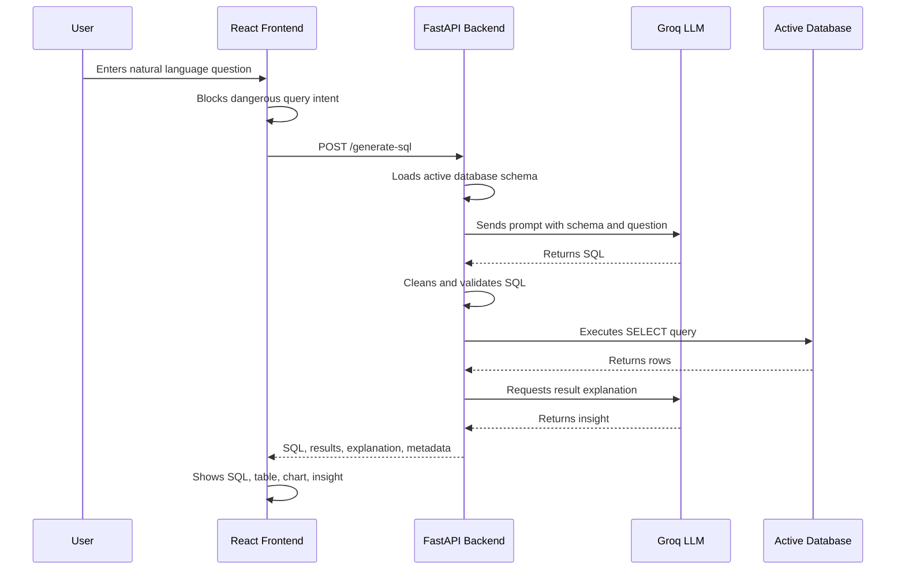
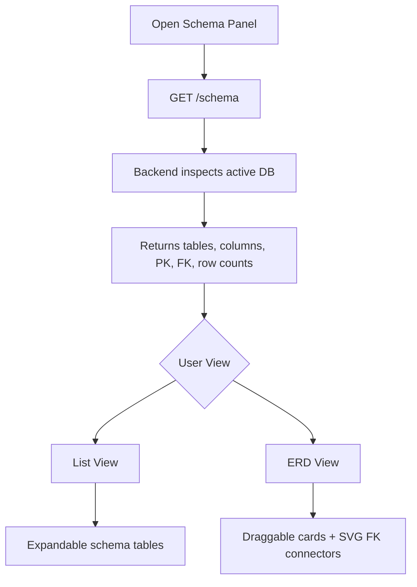
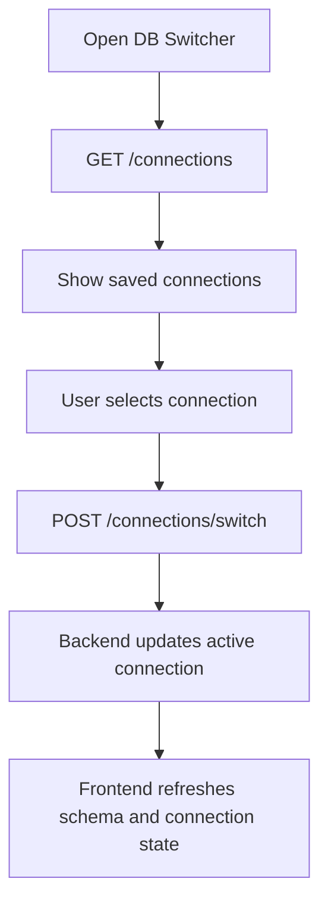

# QueryMind.ai - AI SQL Analytics Platform

## 1. Project Overview

QueryMind.ai is a full-stack AI-powered SQL analytics dashboard that allows users to ask natural language questions about a connected database and receive SQL queries, tabular results, visualizations, and AI-generated insights.

The project is designed as a portfolio-grade analytics application that combines data analysis workflows, database exploration, AI-assisted SQL generation, and a modern SaaS-style frontend.

## 2. Key Capabilities

- Natural language to SQL query generation
- Strict SQL safety validation with SELECT-only execution
- Automatic SQL repair when execution fails
- Query result table with pagination, sorting, filtering, and CSV export
- Auto-generated charts using Recharts
- AI insight summary for query results
- Schema explorer with list view and ERD view
- Draggable ERD table cards with foreign-key relationship lines
- Query history panel
- Bookmarking for important queries
- CSV upload into the active database
- SQLite database upload and switching
- Multi-database connection support for SQLite, PostgreSQL, MySQL, and SQL Server
- Production-style frontend error handling and request timeout handling

## 3. Technology Stack

### Frontend

| Area | Technology |
|---|---|
| Framework | React |
| Build Tool | Vite |
| Language | JavaScript / JSX |
| Visualization | Recharts |
| Styling | CSS with custom design system variables |
| State Management | React hooks |
| API Calls | Fetch API with AbortController timeout |

### Backend

| Area | Technology |
|---|---|
| API Framework | FastAPI |
| Language | Python |
| Database Access | SQLAlchemy |
| Data Processing | Pandas |
| AI Provider | Groq API |
| Validation | Pydantic |
| Server | Uvicorn |

### Databases

| Database | Support |
|---|---|
| SQLite | Default and uploaded `.db` files |
| PostgreSQL | SQLAlchemy connection support |
| MySQL | SQLAlchemy + PyMySQL support |
| SQL Server | SQLAlchemy + pyodbc support |

## 4. High-Level Architecture



## 5. Application Workflow

### Natural Language Query Workflow



### Schema and ERD Workflow



### Database Switching Workflow



## 6. Frontend Architecture

The frontend is implemented as a single-app React architecture in `frontend/src/App.jsx`.

### Major UI Modules

| Component / Area | Responsibility |
|---|---|
| `App` | Main application state, API calls, query execution, panels |
| `SQLBlock` | Animated SQL display, copy action, bookmarking |
| `SchemaPanel` | Schema list view and ERD view toggle |
| `ErdViewer` | Draggable ERD canvas, SVG relationship lines, zoom and pan |
| `DataTable` | Sortable, filterable, paginated result table |
| `ResultChart` | Automatic chart rendering based on result shape |
| `DBSwitcherPanel` | Add, test, upload, delete, and switch database connections |
| `HistoryPanel` | Query history display |
| `BookmarksPanel` | Saved query display |

### Frontend Safety and Stability

- Uses `AbortController` for 30-second API request timeouts
- Handles FastAPI error formats such as `{ "detail": "..." }`
- Uses safe defaults for missing backend fields
- Prevents runtime crashes when `results`, `total_rows`, or `generated_sql` are missing
- Blocks dangerous query keywords before sending a request to the backend
- Escapes CSV values correctly for commas, quotes, and line breaks

## 7. Backend Architecture

The backend is implemented with FastAPI and organized into focused modules.

| File | Responsibility |
|---|---|
| `backend/api.py` | FastAPI routes, SQL execution, query history, uploads |
| `backend/ai_service.py` | Groq LLM calls, prompt building, SQL cleaning, SQL fixing, result explanation |
| `backend/database.py` | SQLAlchemy engine management, connection registry, database switching |
| `backend/schema.py` | Schema introspection and ERD metadata generation |
| `backend/config.py` | AI API key and model configuration |
| `backend/connections.json` | Saved database connections |
| `backend/databases/` | Uploaded and default SQLite database files |

## 8. API Endpoints

### Query and Analytics

| Method | Endpoint | Purpose |
|---|---|---|
| POST | `/generate-sql` | Generate SQL from a natural language question and execute it |
| GET | `/history` | Return query history |
| DELETE | `/history` | Clear query history |
| POST | `/upload-csv` | Upload CSV and create/replace a table |
| POST | `/export-csv` | Generate and export query results as CSV |

### Schema

| Method | Endpoint | Purpose |
|---|---|---|
| GET | `/schema` | Return tables, columns, PK/FK metadata, row counts |
| GET | `/schema/erd` | Return ERD-focused schema graph data |

### Database Connections

| Method | Endpoint | Purpose |
|---|---|---|
| GET | `/connections` | List saved database connections |
| POST | `/connections/test` | Test a new database connection |
| POST | `/connections/add` | Add a new database connection |
| POST | `/connections/switch` | Switch active database |
| DELETE | `/connections/{conn_id}` | Remove a saved connection |
| POST | `/connections/upload-db` | Upload and connect a SQLite `.db` file |

### Legacy Compatibility

| Method | Endpoint | Purpose |
|---|---|---|
| GET | `/databases` | Legacy database list endpoint |
| POST | `/databases/switch` | Legacy database switch endpoint |
| POST | `/databases/upload-db` | Legacy SQLite upload endpoint |

## 9. SQL Safety Design

The application uses multiple safety layers before SQL reaches the database.

### Frontend Safety

The frontend blocks dangerous natural language intent before API calls for keywords such as:

- `delete`
- `drop`
- `truncate`
- `update`
- `insert`
- `alter`
- `replace`

### Backend Safety

The backend validates generated SQL before execution:

- SQL must exist
- SQL must start with `SELECT`
- Dangerous SQL keywords are blocked
- Multiple SQL statements are blocked
- `INTO` operations are blocked
- Query output is limited with `LIMIT 500`

### Execution Gate

All execution flows through `safe_execute()`, which calls `validate_sql()` before running the SQL through SQLAlchemy.

## 10. AI SQL Generation Flow

1. User submits a natural language question.
2. Backend loads the active database schema.
3. Prompt is built using the user question and schema context.
4. Groq LLM generates SQL.
5. SQL is cleaned to extract the first valid SELECT statement.
6. SQL is validated for safety.
7. SQL is executed.
8. If execution fails, the backend asks the AI to repair the SQL.
9. Results are returned with optional AI explanation.

## 11. Data Model for Schema Explorer

The frontend expects schema objects in this format:

```json
{
  "table": "albums",
  "row_count": 347,
  "columns": [
    {
      "name": "AlbumId",
      "type": "INTEGER",
      "is_pk": true,
      "is_fk": false,
      "fk_ref_table": null,
      "fk_ref_col": null,
      "not_null": true,
      "unique": false
    }
  ]
}
```

The ERD view derives relationship lines from columns where:

```text
is_fk = true
fk_ref_table is not null
fk_ref_col is not null
```

## 12. UI and Design System

The UI follows a premium dark SaaS analytics style inspired by tools like Linear, Vercel, GitHub dark, Supabase dashboards, and modern AI products.

### Design Characteristics

- Deep dark gradient background
- Cyan/teal primary accent
- Purple/pink secondary accent
- Glassmorphism panels
- Subtle neon glow effects
- Responsive tables and modal panels
- Sticky table headers
- Clean typography hierarchy
- Accessible contrast for text and controls

### Key UI Screens

- Main natural language query screen
- SQL result panel
- AI insight panel
- Data table and chart tabs
- Schema explorer list view
- ERD graph view
- Database connection manager
- Query history
- Bookmarks
- CSV upload suggestions

## 13. Local Setup

### Backend Setup

```bash
cd backend
python -m venv venv
venv\Scripts\activate
pip install -r requirements.txt
uvicorn api:app --reload
```

Backend runs by default at:

```text
http://127.0.0.1:8000
```

### Frontend Setup

```bash
cd frontend
npm install
npm run dev
```

Frontend runs by default at:

```text
http://localhost:5173
```

### Optional Frontend Environment Variable

Create `frontend/.env`:

```env
VITE_API_URL=http://127.0.0.1:8000
```

## 14. Project Folder Structure

```text
sql-ai-tool/
  backend/
    api.py
    ai_service.py
    config.py
    database.py
    schema.py
    requirements.txt
    connections.json
    databases/
      employees.db
      chinook.db

  frontend/
    index.html
    package.json
    vite.config.js
    src/
      App.jsx
      App.css
      main.jsx
      index.css
      assets/
    public/
      favicon.svg
      icons.svg
```

## 15. Production Readiness Notes

The project already includes several production-style patterns:

- Request timeout handling
- Defensive frontend response normalization
- Backend SQL validation
- Connection testing before saving
- Environment-based API URL configuration
- Modular backend files
- Clear UI states for loading, errors, and empty results

Recommended future improvements:

- Add authentication
- Persist query history in a database instead of memory
- Add backend unit tests for SQL validation
- Add frontend component tests
- Add role-based database permissions
- Add deployment configuration
- Add logging and observability
- Add result caching for repeated questions

## 16. Portfolio Positioning

This project demonstrates:

- SQL and database understanding
- Data analysis workflow design
- AI-assisted analytics implementation
- Full-stack engineering ability
- API integration
- Frontend dashboard design
- Data visualization
- Safety-conscious SQL execution
- Product thinking for analyst workflows

For a Data Analyst portfolio, this project is stronger than a static dashboard because it shows the ability to build an interactive analytics product that combines SQL, AI, visualization, and database exploration.

## 17. Short Project Summary

QueryMind.ai is an AI-powered SQL analytics dashboard that lets users ask questions in natural language, automatically generates safe SQL, executes it against connected databases, visualizes the results, and provides AI-generated insights. It includes a schema explorer, ERD viewer, database switching, CSV upload, query history, bookmarks, and production-style error handling.

